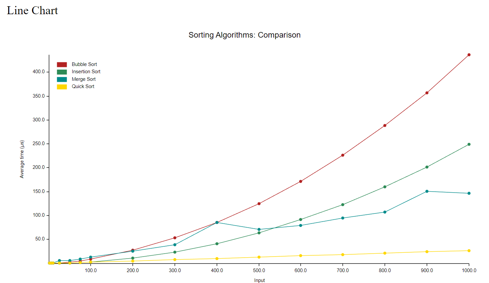

# Sorting-algorithm

Tested and Benchmarked Sorting algorithms in Rust.

## Table of Contents

- [Install](#install)
- [Usage](#usage)
- [Showcase](#showcase)
- [Supported Algoritms](#supported-algoritms)
- [Benchmarks](#benchmarks)

## Install
Clone and install this Github repository
```git 
git clone https://github.com/johannes67890/Sorting-algorithm.git
```
```
cargo install
```
## Usage
```
// Run tests on functions
$ cargo test

// Run benchmarks on functions
$ cargo bench
```

## Showcase
```rust
/// Imported algorithm modules (See `Supported Algoritms`)
mod bubble_sort;
mod quick_sort;

fn main(){
    let mut arr = [6, 2, 4, 1, 9, -2, 5]; // array to sort

    // Bubble sort
    bubble_sort::bubblesort(&mut arr); // sort the array
    println!("Bubble sort: {:?}", arr); // print the sorted array

    // Quick sort
    quick_sort::quicksort(&mut arr); // sort the array
    println!("Quick sort: {:?}", arr); // print the sorted array
}
```
## Supported Algoritms
- Bubble Sort 
- Insertion Sort
- Merge Sort
- Quick Sort
- Shell Sort
## Benchmarks
Line Chart of all supported algoritms from size 1 to 1000 element arrays

## Individual Benchmarks (Size 100)
Benchmarks of all sorting algorithms with size of array of 100 elements. 
### Bubble Sort
```
Sorting Algorithms/Bubble Sort/100
    time:   [8.1996 µs 8.2539 µs 8.3318 µs]
Found 10 outliers among 100 measurements (10.00%)
  1 (1.00%) high mild
  9 (9.00%) high severe
```
### Merge Sort
```
Sorting Algorithms/Merge Sort/100
    time:   [12.033 µs 12.143 µs 12.277 µs]
Found 17 outliers among 100 measurements (17.00%)
  4 (4.00%) high mild
  13 (13.00%) high severe
```
### Insertion Sort
```
Sorting Algorithms/Insertion Sort/100
    time:   [3.0122 µs 3.0183 µs 3.0256 µs]
Found 7 outliers among 100 measurements (7.00%)
  3 (3.00%) high mild
  4 (4.00%) high severe
```
### Quick Sort
```
Sorting Algorithms/Quick Sort/100
    time:   [2.2028 µs 2.2116 µs 2.2222 µs]
Found 10 outliers among 100 measurements (10.00%)
  5 (5.00%) high mild
  5 (5.00%) high severe
```
### Shell Sort
```
Sorting Algorithms/Shell Sort/100
    time:   [2.6537 µs 2.6644 µs 2.6769 µs]
Found 10 outliers among 100 measurements (10.00%)
  6 (6.00%) high mild
  4 (4.00%) high severe
```
# [Back to the top](#sorting-algorithm)
